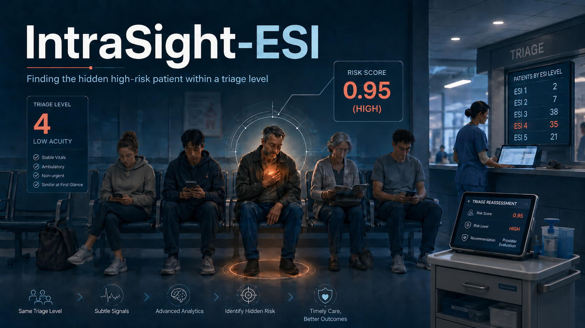

# IntraSight-ESI

**Finding the hidden high-risk patient within a single triage level — built and validated end-to-end on real NHAMCS emergency-department data.**

> Research artifact for the *Triagegeist* competition. **Not validated for clinical use.** See the disclaimer below.



## What this is

Most triage ML predicts the triage *level*. IntraSight-ESI asks a narrower, harder question: among patients **already assigned the same triage stratum**, which ones carry unusually high risk of a serious disposition outcome (hospitalization, transfer, or in-ED death)? It is a prioritization layer for **earlier reassessment** inside the existing pathway — a suggestion to look again sooner, made by a clinician, not a replacement for triage or clinical judgment.

**A note on nomenclature.** NHAMCS does not record the Emergency Severity Index itself. It records `IMMEDR`, a five-level "immediacy with which the patient should be seen" category harmonized from each site's own triage system. "ESI-like 3/4/5" is used as readable shorthand throughout; **all empirical results refer to `IMMEDR` strata, not confirmed ESI.**

## Headline result

On real NHAMCS data the intra-stratum risk signal is robust (within-category permutation Z = 50.86 / 21.38 / 7.97 for ESI-like 3 / 4 / 5). The primary operating point is **ESI-like 4**: alerting the top 5% by score gives PPV 14.1%, recall 26.2%, and **5.24× enrichment** over the base rate in cross-validation, holding at **5.31× [3.36–7.30]** on a 2022 forward holdout with thresholds frozen in advance. Under those frozen cutoffs the realized 2022 alert burdens were 12.9% / 6.2% / 6.5% — the ranking transported, while the operating point of a fixed numeric threshold shifted slightly.

## Why it's built this way

- **Synthetic-data audit first.** The project began on the competition's synthetic set and the lesson came from watching it fail: a stratified permutation test showed no recoverable within-category signal, and a clinician-led audit found physiologically impossible records (BMI clamped to [10, 65], diastolic ≥ systolic, missingness only in low-acuity groups). The audit is reproduced in Section 2 of the notebook; the synthetic data itself is **not redistributed**.
- **Leakage controls.** Three feature sets — Set A (strict triage-only), Set B (EHR-at-triage), and Set C (a deliberate leaky positive control) — confirm the pipeline detects leakage when present. `NUMMED`, `RACERETH`, `PAYTYPER`, and calendar year are excluded from the honest sets.
- **Honest validation.** Leave-One-Year-Out as a *year-blocked robustness* analysis (not a prospective temporal claim) plus a true forward holdout: NHAMCS 2022 is scored once, never touching training, CV, calibration, or threshold selection.
- **Calibration evaluated, ranking-based policy.** Isotonic calibration is assessed as a methodological check; the alert policy ranks raw scores and does not claim individually calibrated probabilities.
- **Fairness audited, not assumed.** `RACERETH`/`PAYTYPER` are never predictors but alert rates and PPV are audited by group and reported transparently.
- **Live recompute.** The notebook runs the entire pipeline from raw fixed-width files to figures with no precomputed artifact read back in, plus a provenance check.

## Repository structure

```
notebooks/   the submission notebook (full pipeline, live recompute)
audit/       synthetic-data audit notebooks (also reproduced in notebook Section 2)
docs/        the project writeup
assets/      cover image and figures
data/        data acquisition instructions (no data committed)
```

## Reproduce

1. **Get the data.** Easiest path: attach the public Kaggle dataset `nhamcs-ed-2015-2022-raw` to the notebook on Kaggle. To run locally, follow `data/README.md` to place the raw NHAMCS ED Public Use Files.
2. **Environment.** `pip install -r requirements.txt` (Python 3.11). On Kaggle these are preinstalled.
3. **Run.** Execute `notebooks/intrasight_esi_v2.ipynb` top to bottom — CPU only, a few minutes. Seeds are fixed (`RANDOM_STATE = 42`) across CV splits, isotonic folds, and permutation tests, so headline numbers reproduce.

## Data & provenance

- **NHAMCS ED Public Use Files**, CDC/NCHS, survey years 2015–2019 and 2022 — **public domain (CC0)**. 2020–2021 are excluded (COVID-era ED utilization and triage practice changed enough to confound temporal modeling). Mirrored for reproducibility in the companion Kaggle dataset `nhamcs-ed-2015-2022-raw`.
- The competition's **synthetic dataset** is read only from the competition input mount for the audit and is **never redistributed** here.
- Reason-for-visit (RFV) code descriptions are decoded verbatim from the official NHAMCS public-domain documentation.

## Links

- Kaggle competition: *Triagegeist* — <https://www.kaggle.com/competitions/triagegeist/>
- Kaggle notebook (executable): <https://www.kaggle.com/code/pabloaguirrearaya/intrasight-esi-v2>
- Kaggle data companion: <https://www.kaggle.com/datasets/pabloaguirrearaya/nhamcs-ed-2015-2022-raw> (`nhamcs-ed-2015-2022-raw`)
- Writeup: [`docs/writeup.md`](docs/writeup.md)

## Citation

See [`CITATION.cff`](CITATION.cff). Methodological reference:

> Raita Y, Goto T, Faridi MK, et al. *Emergency department triage prediction of clinical outcomes using machine learning models.* Critical Care. 2019;23:64. doi:10.1186/s13054-019-2351-7

## License

Code is released under the MIT License (see [`LICENSE`](LICENSE)). NHAMCS data is CC0 (US government public domain) and is not relicensed here.

## Disclaimer

This is a retrospective research prototype on survey data. It is **not a medical device**, has not undergone prospective or external validation, and must not be used to make clinical decisions. Non-alerted patients still require standard reassessment for their assigned triage category.
